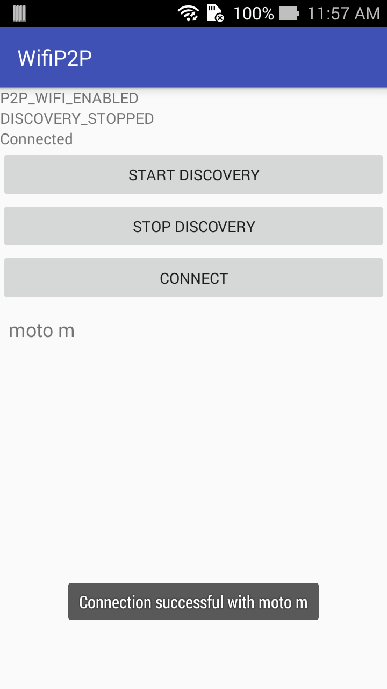
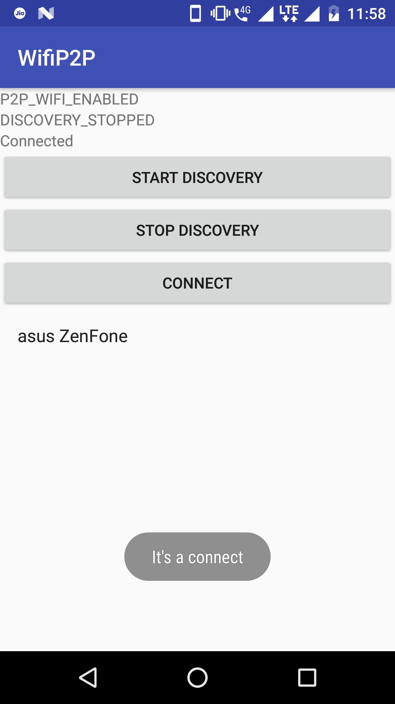

To use the app you need two devices with android 4.0 or above.
1. Run the app in both devices
2. Click `Start Discovery` on both apps.
3. After succussful discovery, a list of available devices will be shown.
4. Choose the device you want to connect.
5. Click connect button
6. View the toasts to see if connection was successful

Screenshots

 

Current issues:
1. Device connectivity is not reliable

