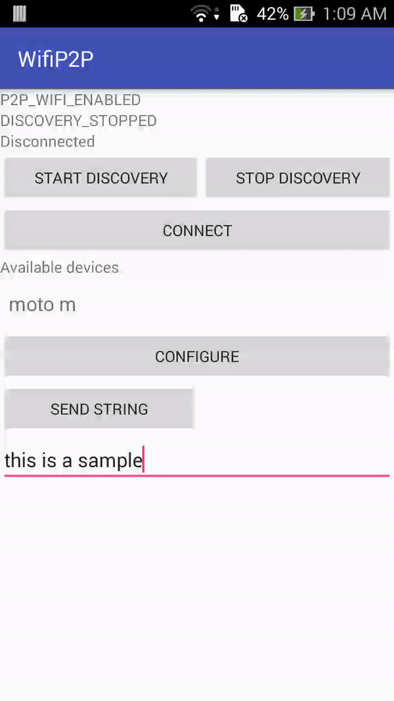
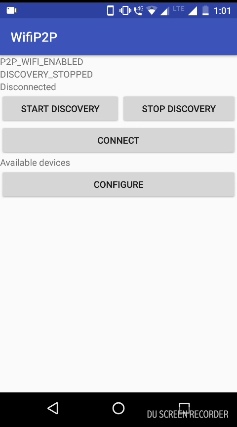

APK link :
<a href ="https://drive.google.com/file/d/1Mmm8ttnb_I-8mKAkl7i6wL6YpvsYei-p/view?usp=sharing">Download</a>

To use the app you need two devices with android 4.0 or above.
1. Run the app in both devices
2. Click `START DISCOVERY` on both apps.
3. After succussful discovery, a list of available devices will be shown.
4. Choose the device you want to connect from any one device.
5. Click `CONNECT` from any one device.
6. Wait for connection to be established.
7. Click `CONFIGURE` on both devices.
8. On one device click `Server Start`
9. View the toasts to see if connection was successful.
10. Type in text box and click `SEND STRING`( complete step 8 first ).
11. View the send data on other device.

Screenshots
<figure>
    <figcaption>Fig1. - Client device.</figcaption>
    
</figure> <figure>
    <figcaption>Fig2. - Server device.</figcaption>
    
</figure>

How it works?
1. The app uses WIFI P2P API to establish connection.
2. After connection establishment, a socket connection is established between two devices.
3. The groupOwner acts as Server and other acts as client.
4. Data is sent through streams. 

Current issues:
1. Device connectivity is not reliable
2. Socket port is hard coded

